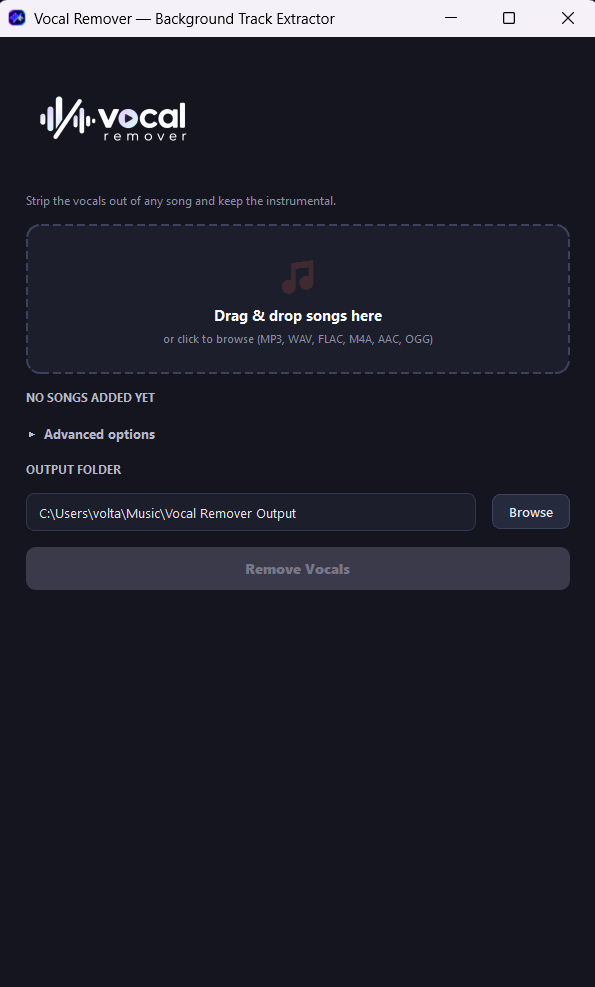
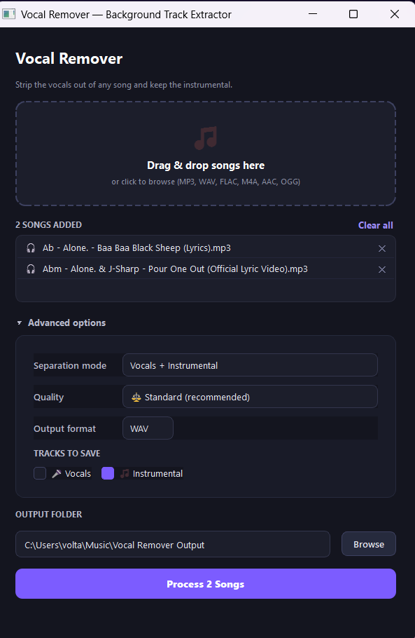
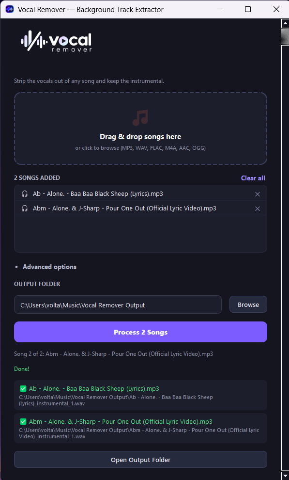

<p align="center">
  
</p>

<h1 align="center">Vocal Remover</h1>

<p align="center">
  Turn any song into a clean instrumental — or split it into full vocals, drums, bass, piano, and more.<br>
  Drag a song in, click a button, get your stems. No Python, no ffmpeg, no cloud upload.
</p>

<p align="center">
  <a href="https://github.com/Volta-Jebaprashanth/audio-background-remover/releases/latest/download/VocalRemoverSetup-1.0.0.exe">
    
  </a>
</p>

<p align="center">
  <b>➡️ <a href="https://github.com/Volta-Jebaprashanth/audio-background-remover/releases/latest/download/VocalRemoverSetup-1.0.0.exe">Download the latest installer (Windows)</a> ⬅️</b><br>
  <sub>Free, offline after first use, nothing to configure. See <a href="#-installation">Installation</a> for details.</sub>
</p>

---

## ✨ What it does


**Vocal Remover** is a Windows desktop app powered by [Spleeter](https://github.com/deezer/spleeter), Deezer's AI source-separation engine. Drop in any song and pull it apart — from a quick vocal-removal for karaoke night, up to a full 5-way split (vocals, drums, bass, piano, other) for remixing, sampling, or practice tracks.

<br clear="left">

- 🎤 **Vocal removal** — keep just the instrumental
- 🥁 **Multi-stem separation** — 2/4/5-stem modes (vocals, drums, bass, piano, other)
- 📦 **Batch processing** — queue up a whole album and let it run
- 🎚️ **Quality presets** — Fast preview / Standard / Best quality
- 🎧 **Your format** — export as WAV, MP3, or FLAC
- 🖱️ **Drag & drop** — no command line, no setup wizard for the AI models
- 🔌 **Fully offline after first use** — models download once per mode, then it just works

## 📸 Screenshots

<p align="center">
  
  
  
</p>

## 📥 Installation

1. **[Download the installer](https://github.com/Volta-Jebaprashanth/audio-background-remover/releases/latest/download/VocalRemoverSetup-1.0.0.exe)** (or grab it from the [Releases page](https://github.com/Volta-Jebaprashanth/audio-background-remover/releases/latest)).
2. Run it. It installs for your user only, so **no admin prompt** — just a Windows SmartScreen "unknown publisher" warning the first time (the app isn't code-signed), which is safe to click through.
3. Launch **Vocal Remover** from the Start Menu (or desktop shortcut, if you checked that box).
4. Drop in a song and hit **Remove Vocals**. The first time you use a given mode (2/4/5-stem), it downloads that AI model over the internet — after that, it's fully offline.

No Python, no ffmpeg, nothing else to install — everything needed is bundled in the installer.

## 🛠 Development

Want to run it from source or build it yourself? See below.

### Requirements

Spleeter depends on an old TensorFlow build that only supports **Python 3.9/3.10** (not whatever newer Python you may have as your system default).

```powershell
# Install Python 3.10 if you don't have it
winget install --id Python.Python.3.10 -e

# Create the project venv with 3.10 specifically
py -3.10 -m venv venv

# Install dependencies
.\venv\Scripts\python.exe -m pip install -r requirements.txt
```

> `numpy` must stay `<2` (pinned in `requirements.txt`) or TensorFlow import breaks. Don't blind `pip install --upgrade` inside this venv.

### Bundled binaries (not in git)

- `app/ffmpeg/ffmpeg.exe` and `app/ffmpeg/ffprobe.exe` — grab a static Windows build, e.g. the "essentials" build from `gyan.dev/ffmpeg/builds`, and copy both `.exe` files from its `bin/` folder into `app/ffmpeg/`.
- Pretrained separation models are **not** bundled from source either — Spleeter downloads each one automatically the first time you run a real separation, as long as `MODEL_PATH` points at `app/pretrained_models` (already wired up).

### Running from source

```powershell
cd app
..\venv\Scripts\python.exe main.py
```

### Building the installer

```powershell
.\scripts\release.ps1 -Version 1.0.0
```

One command: builds the onedir PyInstaller bundle, compiles the Inno Setup installer, tags the repo, and publishes it as a GitHub Release. Requires Inno Setup and the GitHub CLI (`gh`, already authenticated).

See [CLAUDE.md](CLAUDE.md) for the full architecture write-up (why it's a subprocess-per-file design, Windows-specific gotchas, packaging notes, etc.).

## 📝 Notes

- Multi-stem modes (4/5-stem) need noticeably more RAM than 2-stem vocal removal — an in-app warning appears when you pick one.
- First run of each mode needs internet access to fetch its model; after that, it works fully offline.

---

<p align="center">
  Built with ❤️ by <b>Volta Jebaprashanth</b>
</p>

<p align="center">
  <a href="https://www.linkedin.com/in/voltajeba">
    
  </a>
  <a href="mailto:voltajeba@gmail.com">
    
  </a>
  <a href="tel:+94774637185">
    
  </a>
</p>
